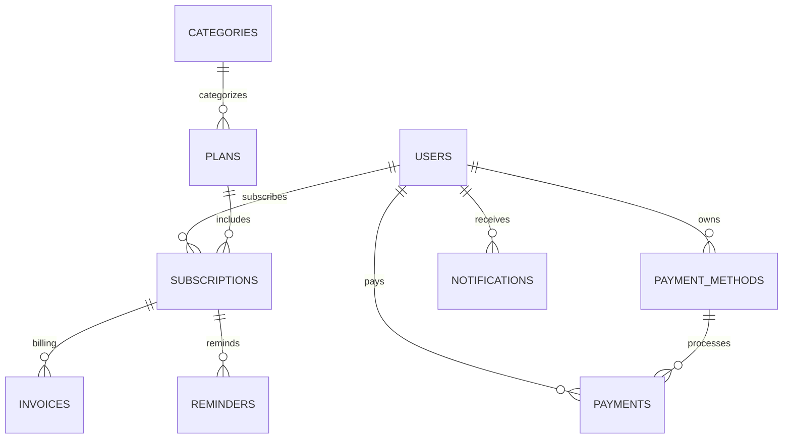

# ⚡ SubMS — Subscription Management System

SubMS is a premium, SaaS-ready **Subscription Management System** built with a stunning, high-performance neon-dark **Glassmorphic** frontend, a secure **PHP/MySQL REST API** backend, and clean, responsive vanilla styles.

Manage, monitor, and optimize your subscriptions easily—browse premium plans, apply discount coupons, link secure payment methods, download system-generated invoices, and track your active subscriptions, all in one centralized dashboard.

---

## ✨ Features & Capabilities

### 🎨 1. Premium Glassmorphic UI/UX
- **Sleek Obsidian & Violet Theme**: A curated dark-mode color scheme with neon violet accents and gradients that give the application a premium SaaS product aesthetic.
- **Glassmorphic Design**: Containers, cards, tables, and popovers feature backdrop blur (`backdrop-filter`), elegant semi-transparent borders, and soft interactive shadows.
- **Smooth Micro-Animations**: Built-in staggered fade-in animations (`fade-in-up`) that occur as elements load to make the app feel alive and extremely premium.
- **Responsive Layout**: Seamless cross-device optimization supporting mobile, tablet, and desktop views.

### 💳 2. Dynamic Plan Browsing & Category Filtering
- **Category Filter System**: Sort subscription plans instantly by category (e.g., *Entertainment & Streaming*, *Developer & SaaS Tools*, *Cloud & Hosting*, *Productivity & Work*).
- **"Most Popular" Visual Highlights**: Highly engaging badges designed to direct users toward featured plans.
- **Promotional Coupons**: Real-time validation for active discount codes (e.g., `WELCOME20`, `SUPER50`) that recalculates pricing on-the-fly and reflects dynamic savings on checkout cards.

### 📊 3. Centralized Subscription Dashboard
- **Active Subscriptions Tracking**: Displays active plans, pricing, start and end dates, and real-time status.
- **Flexible Management**: Auto-renew toggling and one-click instant cancellation capabilities.
- **Auto-Expire Engine**: Smart check logic that automatically transitions expired subscriptions to an `EXPIRED` status upon user dashboard login, sending clear system notifications.

### 💰 4. Integrated Billing & Invoices
- **Custom Payment Methods**: Securely link custom credit cards or UPI IDs directly to your profile.
- **Invoice Records Database**: Auto-generates high-fidelity invoice records for every successful billing cycle.
- **Printable Invoices**: Provides clean, professional HTML invoice downloads with custom billable details, automatic serial padding (`#INV-0001`), and an automatic browser print trigger.

### 🔔 5. Real-Time Activity Feed & Notifications
- Centralized message logs detailing active transactions, cancellation confirmations, expiration warnings, and applied discounts.
- Easily mark notifications as read to keep the feed organized.

---

## 📂 Directory Structure

The project separates dynamic business logic from layout styles for maximum readability and scalability:

```text
project7/
├── index.html                  # Main Single-Page Application (SPA) entry
├── database.sql                # Full MySQL schema creation and seed database script
├── README.md                   # This comprehensive documentation file
├── css/
│   └── style.css               # Centralized Design tokens, Glassmorphic utilities, and animations
├── js/
│   └── app.js                  # Dynamic rendering, client auth logic, AJAX requests & transitions
└── backend/                    # PHP REST API Endpoints
    ├── config/
    │   └── database.php        # MySQLi connection configuration
    ├── auth/
    │   ├── login.php           # User authentication verify endpoint
    │   └── register.php        # Hashed password user registration endpoint
    ├── plans/
    │   ├── get_plans.php       # Dynamic plan fetching endpoint
    │   └── get_categories.php  # Category selection listing endpoint
    ├── payment_methods/
    │   ├── get_methods.php     # Linkable payment options fetcher
    │   └── add_method.php      # New payment instrument registration endpoint
    ├── subscriptions/
    │   ├── subscribe.php       # Core transaction handler (Sub, Payment, Invoice, Notification, Reminder)
    │   ├── cancel.php          # Cancel subscription update endpoint
    │   └── get_subscriptions.php# Dashboard subscription records + auto-expire scheduler
    ├── coupons/
    │   └── validate.php        # Dynamic coupon validity & discount percentages calculator
    ├── payments/
    │   └── get_payments.php    # Transaction history logs fetcher
    ├── invoices/
    │   ├── get_invoices.php    # System invoices table generator
    │   └── download_invoice.php# Print-ready billing document compiler
    └── notifications/
        └── get_notifications.php# Alerts logging and read-status updater
```

---

## 🗄️ Database Schema & Architecture

The database is built on a clean, relational SQL schema. All tables and relationship rules are pre-configured in [database.sql](file:///Users/nabarundey/project7/database.sql).



### Table Dictionary
1. **`users`**: Stores client credentials. Passwords are secured using modern `bcrypt` algorithms (`PASSWORD_DEFAULT` in PHP).
2. **`categories`**: Grouping tags for subscription offerings.
3. **`plans`**: Catalog of subscription offerings (prices, billing intervals, duration).
4. **`payment_methods`**: Saved financial cards or UPI keys associated with users.
5. **`subscriptions`**: The core tracking records representing active links between users and plans, along with start/end periods and renewal state.
6. **`payments`**: Audit records tracking every billing transaction, linked to subscription, user, amount, and the precise payment method used.
7. **`invoices`**: Financial bills generated per subscription transaction.
8. **`notifications`**: User action logs displayed inside the navigation alerts widget.
9. **`reminders`**: Auto-populated triggers set to remind users $N$ days before expiration.
10. **`coupons`**: Discount codes mapping string codes (e.g. `SAVE10`) to discount percentages and expiration conditions.

---

## 🚀 Setup & Installation Guide

Follow these steps to deploy and run SubMS on a local environment:

### Prerequisites
- **Local Web Server**: [XAMPP](https://www.apachefriends.org/), MAMP, WampServer, or a custom PHP + MySQL environment.
- **Web Browser**: Chrome, Safari, Edge, or Firefox.

### Step 1: Clone or Copy Files to Local Server Root
Copy the entire `project` directory into your local server's document root (e.g., `htdocs` for XAMPP):
- **Windows**: `C:\xampp\htdocs\project`
- **macOS**: `/Applications/XAMPP/xamppfiles/htdocs/project`

### Step 2: Initialize the MySQL Database
1. Start your **Apache** and **MySQL** servers from the XAMPP Control Panel.
2. Open your web browser and navigate to **phpMyAdmin** (`http://localhost/phpmyadmin/`).
3. Click on the **SQL** tab.
4. Open the [database.sql](file:///Users/nabarundey/project7/database.sql) file from the project folder, copy its entire contents, paste it into the phpMyAdmin SQL command box, and click **Go**.
5. This automatically creates the `subscription_system2` database, sets up all tables with corresponding constraints, and seeds standard default categories, plans, active discount coupons, and a sample user account.

> [!TIP]
> Alternatively, you can import using the MySQL command-line interface:
> ```bash
> mysql -u root -p < database.sql
> ```

### Step 3: Configure Database Connection
If you use a custom MySQL user or password, open [backend/config/database.php](file:///Users/nabarundey/project7/backend/config/database.php) and update your database credentials:
```php
$host = "localhost";
$user = "root";       // Your MySQL username
$pass = "";           // Your MySQL password
$dbname = "subscription_system2";
```

### Step 4: Run the Application!
Open your web browser and load:
👉 **[http://localhost/project/](http://localhost/project/)**

---

## 🔑 Default Test Credentials

You can log in immediately to inspect the pre-seeded account and dashboard history:

- **Email**: `john@example.com`
- **Password**: `password123`

---

## ⚡ Technical Highlights

### 🚀 Cache-Busting Versioning
To prevent aggressive web browsers from displaying cached obsolete styles and scripts during updates, SubMS uses query-string versioning. Whenever styles or assets are updated, local requests are served with dynamic cache tokens:
```html
<link rel="stylesheet" href="css/style.css?v=2.0" />
```
This forces the browser to discard cache records immediately and load the latest layout system.

### 🛡️ Secure PHP Transactions
The subscription pipeline uses multi-step SQL queries executed with **Prepared Statements** (`mysqli_prepare`) to prevent SQL Injection attacks. Subscription, Payment, Invoice, Notification, and Reminder inserts occur synchronously in a secure transaction workflow.

---

## 📝 License
This project is open-source and available under the **MIT License**.
